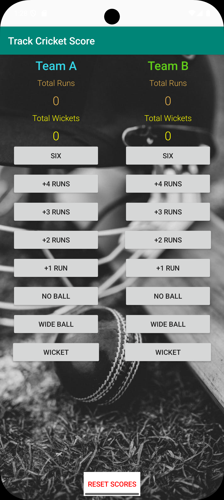
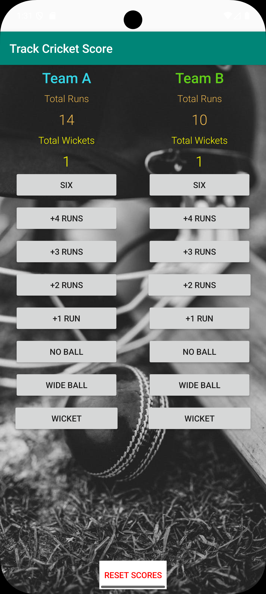

# Cricket Score Tracker 🏏

[](https://developer.android.com)
[](https://android-arsenal.com/api?level=24)
[](https://www.java.com)
[](https://gradle.org)
[](LICENSE)

An Android application for tracking cricket match scores between two teams. Keep track of runs, wickets, and match statistics with an intuitive and user-friendly interface.

---

## 🏷️ Keywords & Topics

**Primary Keywords**: Android Development • Mobile App • Cricket Scoring • Sports Technology • Java Programming • Score Tracking

**Technical Stack**: Android SDK • Java • AndroidX • Gradle • XML Layouts • Material Design • Git Version Control

**App Features**: Real-time Scoring • Wicket Management • Match Reset • Team Statistics • User Interface Design • Touch Controls

**Industry**: Sports Technology • Cricket Analytics • Mobile Gaming • Educational Apps • Open Source • Android Development

**Project Type**: Native Mobile Application • Sports Utility • Educational Project • Portfolio Showcase

---

## Features

- **Score Tracking**: Track runs for both teams (1, 2, 3, 4, 6 runs)
- **Wicket Management**: Count wickets fallen for each team (max 10 per team)
- **Match Reset**: Reset scores and wickets to start a new match
- **Real-time Updates**: Instant score updates with button taps
- **Clean UI**: Simple and intuitive interface for easy scoring

---

## Screenshots

<div align="center">
  
  
</div>

### App Features
| Home Screen | Scoring Interface | Match Reset |
|-------------|-------------------|-------------|
| Clean interface with team names | Easy run buttons (1,2,3,4,6) | Quick reset functionality |
| Wicket counters for both teams | Real-time score updates | Professional cricket layout |

## Demo


---

## Technical Details

- **Platform**: Android
- **Language**: Java
- **Min SDK**: API 24 (Android 7.0)
- **Target SDK**: API 36
- **Build System**: Gradle
- **Architecture**: AndroidX

---

## Getting Started

### Prerequisites
- Android Studio
- Android SDK API 24+
- Java 8+

### Installation
1. Clone the repository
   ```bash
   git clone https://github.com/sandesha21/cricket-score-tracker.git
   ```
2. Open the project in Android Studio
3. Build and run the app on your device or emulator

---

## Usage

1. **Adding Runs**: Tap the run buttons (1, 2, 3, 4, 6) under each team to add runs
2. **Adding Wickets**: Tap the wicket button to increment wickets (max 10)
3. **Reset Match**: Use the reset button to start a new match

---

## Project Structure

```
├── app/
│   ├── src/main/
│   │   ├── java/com/example/android/trackcricketscore/
│   │   │   └── MainActivity.java
│   │   ├── res/
│   │   │   ├── layout/
│   │   │   ├── values/
│   │   │   └── drawable/
│   │   └── AndroidManifest.xml
│   └── build.gradle
├── screenshots/
│   ├── home_screen.png
│   ├── match_progress.png
│   └── demo.webm
├── gradle/
├── build.gradle
├── gradle.properties
├── README.md
├── PROJECT_DESCRIPTION.md
├── .gitignore
└── LICENSE
```

---

## Contributing

1. Fork the repository
2. Create a feature branch (`git checkout -b feature/new-feature`)
3. Commit your changes (`git commit -am 'Add new feature'`)
4. Push to the branch (`git push origin feature/new-feature`)
5. Create a Pull Request

---

## License

This project is licensed under the Apache License 2.0 - see the [LICENSE](LICENSE) file for details.

---

## 👨‍💻 Author  
**Sandesh S. Badwaik**  

[](https://www.linkedin.com/in/sbadwaik/)
[](https://github.com/sandesha21)

---

## Acknowledgments

- Built as part of Android Basics Nanodegree program
- Inspired by the need for simple cricket scoring solutions

---

🌟 If you found this project helpful, please give it a ⭐!